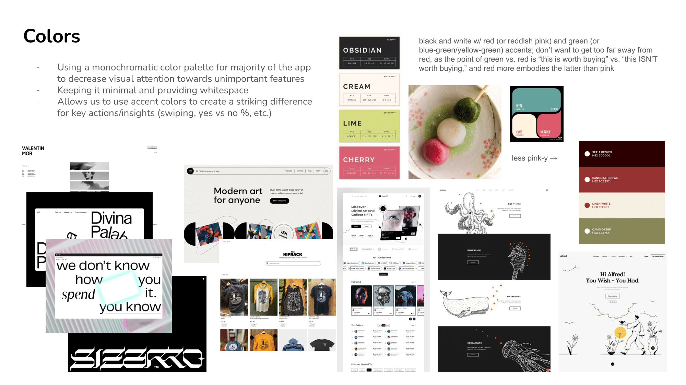

# Table of Contents

- [Updated Problem Framing](./revised_problem_framing.md)
- [Concept Design](#concept-design)
- [Syncs](#syncs)
- [User Journey](#user-journey)
- [UI Sketches](#ui-sketches)
- [Visual Design Study](#visual-design-study)
- [Design Summary](#design-summary)
- [Development Plan](#development-plan)

# Problem Framing (Updated)

[Link to Updated Problem Framing Doc](./revised_problem_framing.md)


# Concept design

Concept design: A collection of concept specifications and syncs; include a note section in each concept and sync to explain any non-obvious design decisions or to mark issues to be resolved.

## Generic Types

```
a set of Items with
	an itemName String
	a description String
	a photo String
    a price Number
    a reason String  // user's reflection on why they want to purchase
    a isNeed String  // user's reflection on is this a "need" or "want"
    a isFutureApprove String  // user's reflection on whether their future-self will like this purchase
    an wasPurchased Flag
    an PurchasedTime Number  [Optional]

a set of Users with
	a name String
	an email String
	a password String
	a profilePicture String
    a reward Number
    a set of FieldsOfInterests

a set of FieldsOfInterests
    a field String
```

### Notes

Here we define the generic types for our systems that are used across different concepts. We will clarify some of the attribute definition below:

- `Items` are the goods/products users hope to purchase.
- When an user adds an item to their wish list, we hope to prompt them through a list of thoughtful, self-reflection questions so that they can take a moment to reflect on whether their intended purchase is impulsive or not. We record the answers to these questions under Item:
  - `reason`: This records the answer for "Why do you want this item?"
  - `isNeed`: This records the answer for "Is this a need or a want?" We want the users to self-reflect on whether a purchase is a genuine necessity or it's an unnecessary want.
  - `isFutureApprove`: This records the answer for "Would Future-You approve?" This prompts the user to consider the consequences of the purchase, helping them to self-identify whether the intended purchase is impulsive or not.
- For each user, we record their sets of FieldOfInterests, which are fields of purchases they are interested in (for example: Fashion, Electronics, Books, Sport, etc.). We will use this information in our queue system to give users queues that they are more related to.

## ItemCollection

```
concept: ItemCollection [User, Item, AmazonAPI, GeminiLLM]

purpose:
    Tracks and manage items that users are considering for purchase.

principles:
    (1) Users maintain a personal wishlist of items they intend to purchase.
    (2) Adding an item requires users to enter reflection questions.
    (3) Item metadata is fetched from AmazonAPI to reduce user effort.
    (4) Users can update attributes of the items they own.
    (5) Users can mark items as purchased after they made the purchase.

state:
    a set of WishLists with
        an owner User
        an itemSet set of Items

    an amazonAPI AmazonAPI
    a geminiLLM GeminiLLM

actions:
    addItem (owner: User, url: String, reason: String, isNeed: String, isFutureApprove: String): (item: Item)
        effect
            fetch item's itemName, description, photo, and price with amazonAPI;
            create a new item with (itemName, description, photo, price, reason, isNeed, isFutureApprove, wasPurchased=False);
            add item to the itemSet under the wishlist with owner matching this user;
            return the added item;

    removeItem (owner: User, item: Item)
        requires
            exists a wishlist $w$ with this user;
            item exists in $w$'s itemSet;
        effect
            remove item from the itemSet;

    updateItemName (owner: User, item: Item, itemName: String)
    updateDescription (owner: User, item: Item, description: String)
    updatePhoto (owner: User, item: Item, photo: String)
    updatePrice (owner: User, item: Item, Price: Number)
    updateReason (owner: User, item: Item, Reason: String)
    updateIsNeed (owner: User, item: Item, isNeed: String)
    updateIsFutureApprove (owner: User, item: Item, isFutureApprove: String)
        requires
            exists a wishlist $w$ with this user;
            item exists in $w$'s itemSet;
        effect
            update the given attribute of this item;

    setPurchased (owner: User, item: Item)
        requires
            exists a wishlist $w$ with this user;
            item $i$ exists in $w$'s itemSet;
            $i$.wasPurchased is False;
        effect
            set $i$.wasPurchased as True;
            set $i$.PurchasedTime as the current time of this action;
    
    async getAIInsight (owner: User, item: Item): (llm_response: String)
        requires
            exists a wishlist $w$ with this user;
            item exists in $w$'s itemSet;
        effect
            send item to geminiLLM (including all the attributes under item, like description, price, reason, isNeed, isFutureApprove) and ask for insights on whether geminiLLM thinks this purchase is impulsive;
            return the llm_response;

```

### Note

- We abstract AmazonAPI because its implementation (scraping, affiliate API, or proxy) is outside this concept's scope.
- We assume metadata is fetched at the moment of adding the item for accuracy and simplicity.
- We use three generic types here: User, Item, and AmazonAPI. User and Item are defined in the section above.
- getAIInsight is an async, AI-augmented action that we designed to address the lack of critical mass issue. When we don't have enough users to provide swipe states, users can gather some insights on whether the AI thinks a purchase is impulsive or not.

## QueueSystem

```
concept: QueueSystem [User, Item]

purpose:
    Assign a daily queue of items to each user for community swiping.

principle:
    (1) Every user receives a daily queue containing items from other users' added items.
    (2) A queue contains items that the user does not own.
    (3) Items in a queue are chosen to be relevant to the user's interests when possible.

state:
    a set of Queues with
        an owner User
        an itemSet a set of Items
        a completedQueue Number

actions:
    _getCompletedQueue (owner: User): (completedQueue: Number)
        requires
            queue $q$ exists with matching owner
        effect
            return $q$.completedQueue

    generateDailyQueue (owner: User): (queue: Queue)
        requires
            no queue exists with owner matching this user
        effect
            select a set of items that are not owned by this user;
            create a queue with (owner, set of items, and completedQueue = 0);

    incrementCompletedQueue (owner: User, item: Item)
        requires
            exists a queue $q$ under this user;
            item exists in $q$.itemSet;
        effect
            add one count to completedQueue;
            remove item from $q$.itemSet;
```

### Note

1. Separation of concerns: We deliberately separate QueueSystem and SwipeSystem because they represent two different responsibilities in the SwipeSense feature: - QueueSystem determines which items a user must swipe today. - SwipeSystem records what decision the user makes.
   This modular approach makes each concept independently testable and easier to maintain.

2. A queue ensures that swiping is equitable and participatory. Users must complete their assigned queues before receiving community feedback on their own items. This structure supports the fairness model described in our problem framing (i.e., balanced community participation). In particular, we maintain the `completedQueue` attribute under each queue to keep track of how many of the daily queue a user has completed. This allows:

   - Progress tracking (UI feedback).
   - Determining when the queue is finished.
   - Enforcing that users complete their daily queue before requesting feedback on their own items. In implementation, we will set a threshold (i.e., 10 queues per day) that a user must complete to receive feedbacks from other users.

3. Queues contain items from other users only. This prevents self-influence or score manipulation. It reinforces the integrity of community-based reflection.

4. Here, to keep our concept modular, we blackboxed the queue-generation algorithm in the `generateDailyQueue` action. When we actually implement this, we will incorporate users’ FieldsOfInterest when selecting items for their queue. This increases the quality of community judgments (people swipe on things they understand) while improving user engagement and system fairness.

## SwipeSystem

```
concept: SwipeSystem [User, Item]

purpose:
    Record swipe decisions made by users about items in their queues and make aggregated community feedback available.

principle:
    (1) Each swipe represents one user's judgment on one item.
    (2) A user may decide to swipe "approve" or "disapprove" on an item once per queue. The decision is recorded.
    (3) Swipe decisions accumulate over time to produce simple, interpretable statistics for community feedback (e.g., the percentage of users who recommend buying an item).

state:
    a set of Swipes with
        an owner User
        an item Item
        a decision Flag [Optional]  // user's swipe decision (i.e., worth buying or not)
        a comment String [Optional] // user's short reason or remark (e.g., "this is a great/bad product, super useful/less!" )
action
    _getSwipeStats (owner: User, item: Item): (total: Number, approval: Number)
        requires
            exists at least one swipe with matching (owner, item)
        effect
            let positive := number of swipes with matching (owner, item) and decision equals "Buy"
            let negative := number of swipes with matching (owner, item) and decision equals "Don't Buy"
            return total = positive + negative and approval = positive
    
    _getSwipeComments (owner: User, item: Item): (comments: set of String)
        requires
            exists at least one swipe with matching (owner, item) and comment is not None
        effect
            return all comments under swipes that has matching (owner, item) and comment is not None

    recordSwipe (owner: User, item: Item, decision: Flag, comment: String)
        requires
            no swipe exists with matching (owner, item)
        effect
            create a new swipe with (owner, item, decision, comment)

    updateDecision (owner: User, item: Item, newDecision: Flag, newComment: String)
        requires
            swipe exists with matching (owner, item)
        effect
            update this swipe's decision to newDecision
            update this swipe's comment to newComment;

```

### Note

- We model one decision per (user, item) to keep aggregation simple and avoid vote manipulation.
- The decision flag should be a binary Flag. It represents the user's insight on whether an item is worth buying or not.

## UserAuth

```
concept: UserAuth [User, FieldsOfInterests]

purpose:
    Manages users that are registered under BuyBye.

principle:
    (1) Each user account is uniquely identified by an email address.
    (2) Users can create an account by signing up with basic information.
    (3) Users can log in with valid credentials.
    (4) Logged-in users can edit their own profile information.

state:
    a set of RegisteredUsers with
        a user User

    a set of LoggedInUsers with
        a user User

    signup (name: String, email: String, password: String, profilePicture: String, fieldsOfInterests: FieldsOfInterests): (user: User)
        requires
            no registered user exists with matching email
        effect
            create a new user $u$ with (name, email, password, profilePicture, reward = 0, fieldsOfInterests);
            add user $u$ to RegisteredUsers;
            return user $u$;

    login (email: String, password: String): (user: User)
        requires
            exists a user in RegisteredUsers with matching (email, password)
        effect
            add this user to LoggedInUsers;
            return this user;

    logout (user: User)
        requires
            user exists in LoggedInUsers;
        effect
            remove this user from LoggedInUsers;

    updateProfileName (user: User, newName: String)
    updateProfilePicture (user: User, newProfilePicture: String)
    updatePassword (user: User, newPassword: String)
        requires
            exists user in LoggedInUsers
            exists user in RegisteredUsers
        effect
            update the corresponding attribute of this user

    updateInterests (user: User, newFieldsOfInterests: FieldsOfInterests)
        requires
            exists user in LoggedInUsers
            exists user in RegisteredUsers
        effect
            update this user's set of FieldsOfInterests to newFieldsOfInterests;
```

### Note

1. RegisteredUsers vs LoggedInUsers: - RegisteredUsers represents all accounts in the system. - LoggedInUsers represents the subset of users who have an active session.
   This separation keeps authentication concerns (who is logged in) distinct from account existence.

2. Email as Unique Identifier: We enforce uniqueness of email in the `signup` action, since email is a natural key for accounts.

3. Editing Profiles Requires Being Logged In: All profile updates require the user to be in LoggedInUsers. This matches real-world expectations and avoids unauthorized modifications.

4. Password Handling: We treat password as a simple String here because this is a concept-level specification, not an implementation. In a real system, this would be a hashed value, but that detail is intentionally abstracted away for this assignment.

5. FieldsOfInterests Integration: Allowing users to enter and update their fieldsOfInterests is important because other concepts (like QueueSystem) depend on up-to-date FieldsOfInterests to give users relevant items in their daily queues. Keeping this in UserAuth makes it clear where the user can manage their preferences. FieldsOfInterests is another generic type we defined in the very beginning.

# Syncs

## 1. Authentication + session syncs

These connect HTTP auth endpoints to UserAuth and Sessioning. Sessioning represents the system’s notion of active login sessions. While UserAuth manages user accounts (who exists, who is allowed to log in), Sessioning handles the temporary authentication state, like, who is currently logged in during an interaction with the system. 

We intentionally separate UserAuth and Sessioning because they solve two distinct problems:
- UserAuth: user creation, credential validation, profile editing. This is the concept we defined above.
- Sessioning: transient login state, session lifecycle, request authentication. We reference this Sessioning from the 6.1040_backend_concept that we had for the personal project, so we assume Sessioning concept is already designed and specified the same way as before.

### sync Signup

```
sync Signup

when
    Requesting.request (
        path: "/auth/signup",
        name,
        email,
        password,
        profilePicture,
        fieldsOfInterests
    ) : (request)

then
    UserAuth.signup (name, email, password, profilePicture, fieldsOfInterests) : (user)
    Sessioning.createSession (user) : (session)
    Requesting.respond (request, session, user)
```

### sync Login

```
sync Login

when
    Requesting.request (path: "/auth/login", email, password) : (request)

then
    UserAuth.login (email, password) : (user)
    Sessioning.createSession (user) : (session)
    Requesting.respond (request, session, user)
```

### sync Logout

```
sync Logout

when
    Requesting.request (path: "/auth/logout", session) : (request)

where
    in Sessioning: user of session is user

then
    Sessioning.deleteSession (session)
    UserAuth.logout (user)
    Requesting.respond (request, status: "logged_out")
```

## 2. PauseCart / ItemCollection syncs

These syncs ensure that only the authenticated user can manage items in their own wishlist (PauseCart).

### sync AddItemToWishlist

```
sync AddItemToWishlist

when
    Requesting.request (path: "/items/add", session, url, reason, isNeed, isFutureApprove) : (request)

where
    in Sessioning: user of session is owner

then
    ItemCollection.addItem (owner, url, reason, isNeed, isFutureApprove) : (item)
    Requesting.respond (request, item)
```

### sync UpdateItemReflection

```
sync UpdateItemReflection

when
    Requesting.request (path: "/items/updateReflection", session, item, reason, isNeed, isFutureApprove) : (request)

where
    in Sessioning: user of session is owner

then
    ItemCollection.updateReason (owner, item, reason)
    ItemCollection.updateIsNeed (owner, item, isNeed)
    ItemCollection.updateIsFutureApprove (owner, item, isFutureApprove)
    Requesting.respond (request, status: "updated")
```

### sync RemoveItemFromWishlist

```
sync RemoveItemFromWishlist

when
    Requesting.request (path: "/items/remove", session, item) : (request)

where
    in Sessioning: user of session is owner

then
    ItemCollection.removeItem (owner, item)
    Requesting.respond (request, status: "removed")
```

### sync MarkItemPurchased

```
sync MarkItemPurchased

when
    Requesting.request (path: "/items/setPurchased", session, item) : (request)

where
    in Sessioning: user of session is owner

then
    ItemCollection.setPurchased (owner, item)
    Requesting.respond (request, status: "purchased")
```

## 3. QueueSystem syncs (generate & progress)

These implement the SwipeSense daily queue and tie it to the logged-in user.

### sync GenerateDailyQueueRequest

```
sync GenerateDailyQueueRequest

when
    Requesting.request (path: "/queue/generate", session) : (request)

where
    in Sessioning: user of session is owner

then
    QueueSystem.generateDailyQueue (owner) : (queue)
    Requesting.respond (request, queue)
```

### sync SwipeFromQueue

```
sync SwipeFromQueue

when
    Requesting.request (path: "/swipes/record", session, item, decision, comment) : (request)
where
    in Sessioning: user of session is owner
    in QueueSystem: item is in current queue for owner
then
    SwipeSystem.recordSwipe (owner, item, decision, comment)
    QueueSystem.incrementCompletedQueue (owner, item)
    Requesting.respond (request, status: "recorded")
```

**Note:** For SwipeFromQueue, when a user swipes on an item that comes from their current queue, we want to both record the swipe and bump the completedQueue counter in QueueSystem.

## 4. SwipeSystem and ItemCollection syncs (viewing insights and feedback)

These expose aggregated SwipeSense data only after the user has participated enough in other people's queues.

### sync GetItemCommunityStats

```
sync GetItemCommunityStats

when
    Requesting.request (path: "/items/communityStats", session, item) : (request)
where
    in Sessioning: user of session is owner
    QueueSystem._getCompletedQueue(owner: user) is >= 10
    
    in ItemCollection: item belongs to wishlist of owner
    in QueueSystem: queue for owner has completedQueue >= 10

    comments is set of all c where
        there exists s in swipes with s.comment = c
then
    SwipeSystem._getSwipeStats(owner: user, item): (total, approval)
    SwipeSystem._getSwipeComments (owner: user, item): (comments)
    Requesting.respond (request, { total, approval, comments })
```

### sync GetAIFeedback

```
sync GetAIFeedback

when
    Requesting.request (path: "/items/AIFeedback", session, item) : (request)

where
    in Sessioning: user of session is owner

then
    ItemCollection.getAIInsight (owner: user, item): (llm_response)
    Requesting.respond (request, llm_response)

```

# User Journey

## "Bez Jeffos and the Midnight Cart"

Under stress, Bez Jeffos shops with the same energy some corporations bring to mass layoffs: sudden, sweeping decisions powered by the belief that whatever happens next… well, that's tomorrow's problem. The night before a major exam, he's sitting in his dorm room, mentally tired and looking for distraction. As he scrolls through Amazon "just for a minute," his cart quietly fills with a 24-pack of Sugar-Free Red Bull, a CASABREWS espresso machine, a tortilla baby burrito swaddle blanket, and an inflatable roast turkey costume. He recognizes the pattern: stress leading to increasingly questionable items, and knows that by morning he'll be wondering why he ever thought he needed any of this.

### Step 1 - PauseCart Interrupts the Spiral

Instead of checking out, Bez remembers he installed ByeBuy.

He switches tabs. He already has an account on the app, so he just logins. On the wishlist page of the app, he copies the first Amazon link and pastes it into the "Add Item" field. This triggers:

```
→ AddItemToWishlist → ItemCollection.addItem
```

ByeBuy automatically pulls the item's photo, price, and details, then prompts him with three short reflection questions before it can be added to his PauseCart:

- "Why do you want this item?"
- "Is this a need or a want?"
- "Would Future-You approve?"

He answers each as he goes:

**Red Bull 24-pack**

- Why? "I need energy and this is cheaper in bulk."
- Need or want? "Want."
- Future approval? "Probably not."

Satisfied (but already questioning himself), Bez pastes the link for the next item:

**Espresso machine**

- Why? "Could save money long-term (hopefully)."
- Need or want? "Want."
- Future approval? "Maybe."

Then the third link:

**Tortilla baby burrito blanket**

- Why? "It's funny."
- Need or want? "Want."
- Future approval? "No :("

Finally, he pastes the link for the inflatable turkey costume. He starts typing an explanation, stops halfway through, realizes there is no explanation that would make sense, and silently adds it anyway.

One link at a time, the reflection prompts him to slow down, interrupting the late-night emotional momentum that led him here. After adding the last item, he closes the app and decides his future self—hopefully more awake—will deal with everything in the morning.

### Step 2 - SwipeSense Adds Community Perspective

The next day, Bez opens ByeBuy again. The app generates his daily swipe queue, created via:

```
→ GenerateQueueRequest → QueueSystem.generateDailyQueue
```

This time he's shown items that other students are debating:

- A gallon-sized cold brew dispenser someone claims is "cheaper than therapy."
- A portable mini projector captioned, "for movie nights I will definitely host."
- A set of color-coded cable organizers from someone trying to "finally get my life together."
- A cat-shaped mug warmer posted by a user who admits, "I don't own a cat. I just like the vibe."

As he swipes through the queue, Bez notices he evaluates other people's picks far more critically than he does his own. Apparently it's easier to be objective when the impulse belongs to someone else. BuyBye records each choice using:

```
→ SwipeFromQueue → SwipeSystem.recordSwipe + QueueSystem.addCompletedQueue
```

Seeing such a wide range of equally impulsive items makes his own late-night picks feel far less embarrassing and reminds him that he's not the only one who shops under stress.

### Step 3 - Reviewing Community Insight

Once he completes his queue, ByeBuy unlocks community feedback on his own PauseCart.

- The Red Bull 24-pack gets cautious disapproval, with most users suggesting sleep might be a better strategy.
- The espresso machine receives mixed feedback in the comments: split between "practical investment" and "wishful thinking."
- The tortilla blanket gets low approval but earns remarks about its comedic value.
- The turkey costume receives near-unanimous rejection, politely urging him to reconsider.

The feedback feels gentle rather than judgmental, giving Bez a fresh perspective he didn't have the night before.

### Step 4 - A More Intentional, Informed Decision

Bez removes the items that no longer make sense in daylight:

```
→ ItemCollection.removeItem
```

He ends up keeping just one—the tortilla blanket—because even now, it still brings him joy and isn't a risky purchase.

He marks it as purchased:

```
→ ItemCollection.setPurchased
```

Two weeks later, ByeBuy's mascot Pig bounces onto his stats page with a celebratory squeal:

> "You avoided $257 of impulsive spending this month! That's serious willpower, Bez."

The message surprises him; he hadn't realized how often late-night stress had been guiding his decisions.

### Outcome

By the end of the journey, Bez feels more in control of his online shopping habits. ByeBuy doesn't stop him from buying things he enjoys. Instead, it gives him space to reflect, gather perspective, and make decisions he won't regret. Through PauseCart, SwipeSense, and simple follow-up insights, Bez learns to navigate stress-driven shopping with more clarity and far fewer turkey costumes.

## UI Sketches


## Visual Design Study




## Design Summary

### How the concepts work together to solve the problem

- **UserAuth**

  - Creates and manages accounts so that each user has a unique identity within the ByeBuy community, along with personalized data/statistics on their shopping habits and history.
  - Stores each user’s FieldsOfInterests so that swipe queues feel relevant to what they actually care about. This benefits both sides of the system: the user swiping gets items they’re more knowledgeable about, and the user who added the item receives feedback from someone with overlapping interests.

- **ItemCollection**

  - Stores items with core metadata fetched from Amazon so the experience remains integrated with real shopping rather than feeling detached or “manual.”
  - Provides a low-effort, wishlist-like space that serves as a reflective pause before checkout. Users can add, remove, and update items with minimal friction, and can mark items as purchased so their stats page remains accurate and immediately responsive to their actions.

- **QueueSystem**

  - Builds users’ daily swipe queues, enabling the community-feedback aspect of ByeBuy and helping users make more grounded decisions without being trapped in their own impulsive reasoning.
  - Tracks progress within each queue, giving users clear feedback on how many daily swipes they’ve completed and making the process feel structured rather than open-ended or endless.

- **SwipeSystem**
  - Records the swipe actions that each user performs, accumulating community data that then feeds into per-user statistics and reflective insights about their impulsive shopping habits.
  - Maintains a clean separation of responsibilities: QueueSystem determines what appears in the queue, while SwipeSystem records the decisions that ultimately generate the feedback users see on their own items.

### How the design addresses concerns raised in the ethics analysis

- Supports intentionality without restricting autonomy: Reflection questions in ItemCollection help users pause and think, but users still control their own wishlists and can ignore reflection results if they choose. No action in the system blocks, delays, or prevents users from completing a purchase—ByeBuy provides perspective, not enforcement.

- Avoids shaming or moralizing: Community feedback comes from SwipeSystem as aggregated statistics (percent approve / disapprove), never from individual named users. Also, the system avoids language that frames items as “good” or “bad”; instead, it presents neutral data and LLM-generated feedback—also framed to be friendly, gentle, and neutral—to help users judge their own habits.

- Minimizes unnecessary data collection: Concepts only store what is required to provide reflection or feedback: item metadata, swipe decisions, and user-chosen reflections. There is no purchase scraping, bank connections, or continuous surveillance used, protecting user privacy.

- Reduces risks of guilt-tripping and over-dependence on others’ opinions: QueueSystem requires modest community participation to unlock insights but does not overload users with constant judgment. Also, insights remain descriptive (e.g., “40% of users marked this as a want”) rather than moralizing or predictive about user behavior—improvements in statistics are driven by the user’s decision to improve their shopping habits upon seeing their data, not completely by relying on others to tell them what to do.

- Promotes fairness in community data: Using FieldsOfInterests to select queue items increases the chance that users cast informed votes, preventing uninformed or biased swipes. Also, queue completion ensures everyone contributes before receiving help, addressing fairness concerns.

### Which issues remain unclear

- Queue generation details: How exactly items are selected based on FieldsOfInterests (weighting, randomness, diversity of items) is not fully defined, but we left this as implementation details that can, for now, be black-boxed. Also, we don’t yet specify how to avoid repetition or ensure fair distribution of items across the community.

- Thresholds for unlocking community feedback: We have not yet decided on the specific number of swipes assigned (e.g., 10) in the daily queue that allows users to receive feedback on their own items. Also, it’s unclear whether partial queue completion should unlock partial feedback.

- Quality and reliability of community data: No rules yet define minimum sample size for community stats (e.g., should we hide stats if only 3 people swiped?). Also, we haven’t defined behavior for handling noisy or bad-faith swipes (e.g., detecting if a user is swiping rapidly without reading).

- Handling AmazonAPI failures or item inaccuracies: We don’t yet specify fallback flows if API metadata is missing, if URLs change, or if an item goes out of stock.

- Gamification system: The reward field on User exists, but we haven’t yet settled on the exact implementation details of the rewards system. We need to avoid reward mechanics that create pressure or addictive behavior.

- Dependence on self-reported reflections: Users may provide low-effort answers to the reflection prompts; we haven’t yet detailed mechanisms that will help users meaningfully engage without feeling too policed.

## Development Plan

### Checkpoint Alpha: Nov 25

Group check-ins

1. Sunday, Nov 23rd (backend complete + integrated properly)
2. Tuesday, Nov 25th (scrappy frontend MVP complete)

| Person   | Responsibilities                                                                                                                                                                  |
| -------- | --------------------------------------------------------------------------------------------------------------------------------------------------------------------------------- |
| Elaine   | - ItemCollection concept implementation (add/remove/update/setPurchased) <br> - PauseCart-related syncs <br> - AmazonAPI mock + integration in addItem                            |
| Fuqi | - QueueSystem concept implementation <br> - Queue generation logic (basic version) <br> - Queue progress syncs (generateDailyQueue, SwipeFromQueue portion affecting QueueSystem) |
| Lauren   | - SwipeSystem concept implementation <br> - Swipe recording/update logic <br> - Community stats sync (GetItemCommunityStats)                                                      |
| Stanley | - UserAuth concept implementation <br> - Authentication syncs (signup/login/logout) <br> - Session + User profile update actions <br> - Backend wiring / endpoint scaffolding     |

### Checkpoint Beta: Dec 2

Group check-ins

1. Monday, Dec 1st (look at revised frontend together and work on finding any remaining bugs)
2. Tuesday, Dec 2nd (final review)

| Person   | Responsibilities                                                                                                                                                                                                                                |
| -------- | ----------------------------------------------------------------------------------------------------------------------------------------------------------------------------------------------------------------------------------------------- |
| Elaine   | PauseCart <br> - Build the PauseCart main view displaying wishlist items <br> - Implement the “Add Item” flow (URL input + reflection prompts) <br> - Create the item detail/edit interface (update reflections, remove items, mark purchased)  |
| Lauren   | Daily Queue <br> - Build the Daily Queue screen showing items one-by-one <br> - Implement swiping interactions and queue progress <br> - Add post-swipe transitions and UI feedback                                                             |
| Fuqi | Community Feedback & Insights <br> - Build the Community Stats page after queue completion <br> - Implement “locked vs unlocked” UI state for stats <br> - Create the insights/history section (past swipes, trends, spending info)             |
| Stanley | Authentication, Navigation, and Settings <br> - Build signup, login, and logout screens <br> - Implement global navigation + routing between pages <br> - Create the user profile/settings page (edit name, profile picture, FieldsOfInterests) |


### Key Risks

#### **Risk 1: Too Many Features / Overambition**

**Why it’s risky:**  
We have three full features (PauseCart, SwipeSense, WalletWhisper). Queue logic and community statistics add complexity quickly.

**Mitigation Plan:**  
- Prioritize features strictly in this order: **PauseCart → SwipeSense → WalletWhisper**.  
- Keep V1 implementation simple (no complex reward algorithms, no long-term analytics).  
- Use mocked Amazon metadata during early development, replacing it only if time allows.

**Fallback:**  
- Ship PauseCart + basic swiping without daily queue requirements.  
- Skip WalletWhisper entirely if time becomes limited.

---

#### **Risk 2: Amazon API Doesn’t Work / Scraping Isn’t Permitted**

**Why it’s risky:**  
Amazon’s official API is restricted, rate-limited, or requires approval. Scraping is fragile and may be blocked.

**Mitigation Plan:**  
- Use a mocked AmazonAPI concept that returns sample data.  
- Allow users to manually type name/price if metadata loading fails.

**Fallback:**  
- Remove automatic metadata fetching entirely.  
- Have users paste a link and manually enter item name + price.

---

#### **Risk 3: Complex Queueing or Reward Algorithm Logic**

**Why it’s risky:**  
Daily queue regeneration, interest matching, uniqueness constraints, and progress tracking can be tricky to implement reliably.

**Mitigation Plan:**  
- Begin with a minimal viable version: random 10 items not owned by the user.  
- Add interest-based filtering only in later polish stages.

**Fallback:**  
- Replace QueueSystem with a simple screen:  
  “Swipe on 10 random items” (no daily regeneration or complex logic).

---

#### **Risk 4: Negative User Feedback / Idea Doesn’t Fully Solve the Problem**

**Why it’s risky:**  
Impulse-buying is a behavioral issue; reflection might feel annoying and swiping could feel like extra work.

**Mitigation Plan:**  
- Keep reflection very short (3 quick questions).  
- Add playful/incentivizing UI (Pig mascot, small reward system).  
- Run early informal user tests and adjust flow accordingly.

**Fallback:**  
- Pivot emphasis to PauseCart as the core product.  
- Remove queuing entirely and focus on personal reflection + insights, minimizing social/community dependency.
